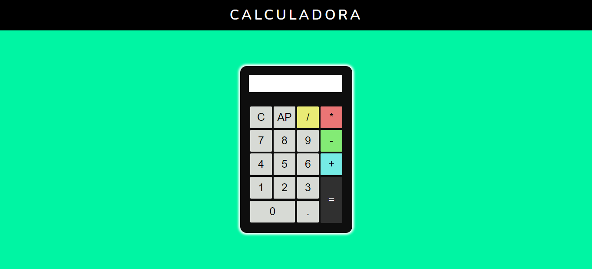

<h1 align="center"><strong>CALCULADORA</strong></h1>

<h1>

</h1>
 <h3 align="center">
<a href="https://relogio.vercel.app/" target="_blank" > 🚀 Acessar a demonstração da calculadora</a></h3>

___

## 📖 ***Sobre***
Uma calculadora simples.

___

## 📌 Tecnologias utilizadas

O projeto foi desenvolvido utilizando as seguintes tecnolgias

- HTML5
- CSS3
- JAVASCRIPT
___
💻 O projeto foi desenvolvido por Thiago Santos.